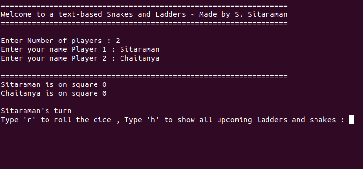
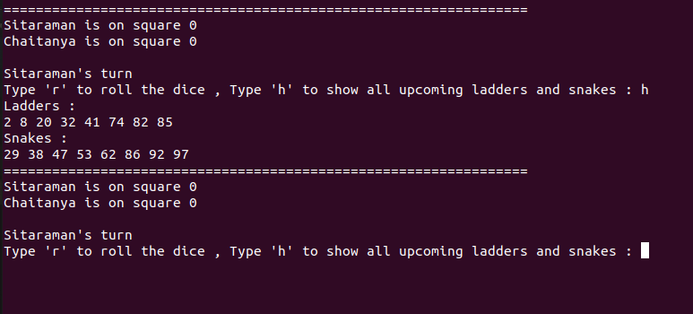
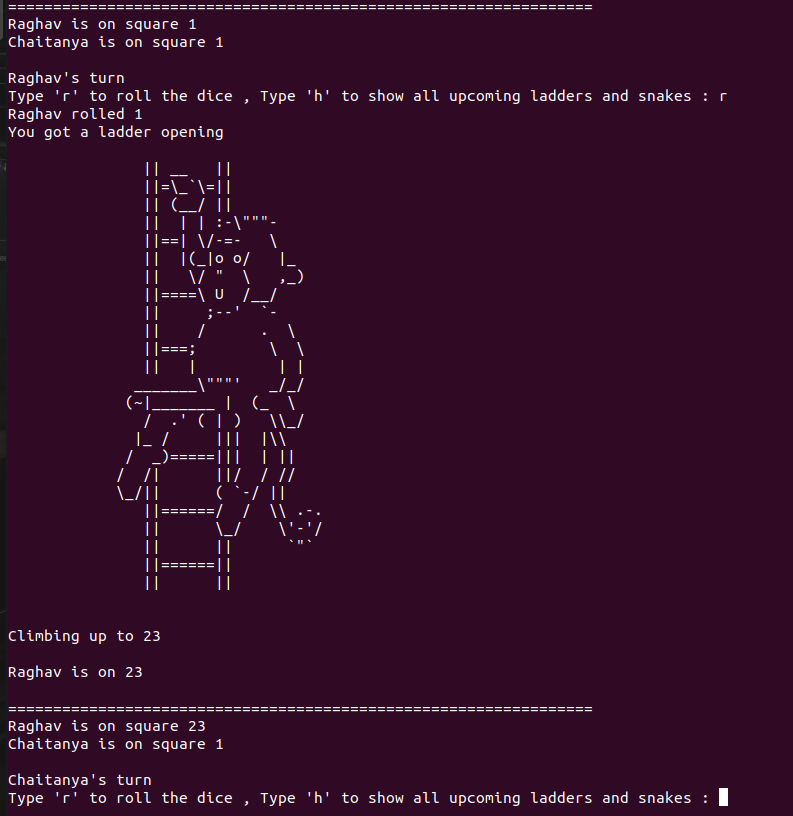
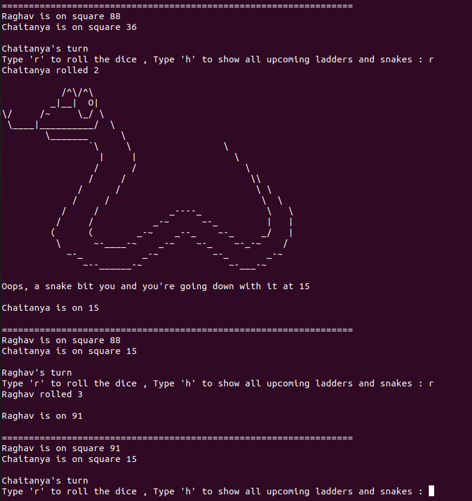
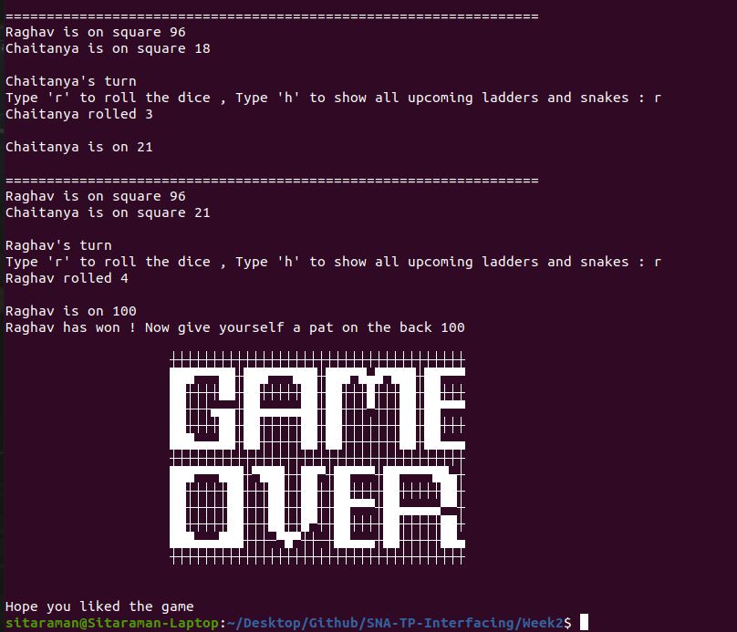

# Week 2 - Task : Make a multiplayer Snakes and Ladders in Python

### To run the game :

`python main.py`

### This is a text based snakes and ladders game, Game Snapshots : 

* #### Number of Players

    

* #### Viewing ladders openings and Snake mouth squares

    

* #### Viewing ladders openings and Snake mouth squares

    

* #### Snake square and going down

    

* #### Winning the Game

    
